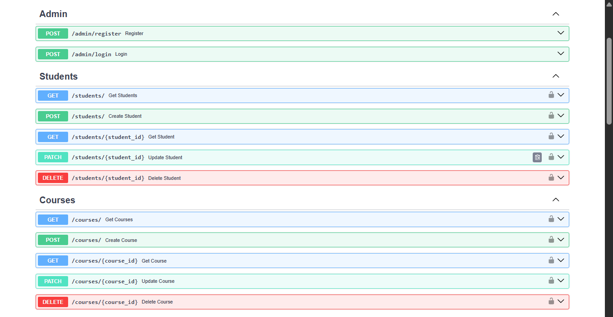
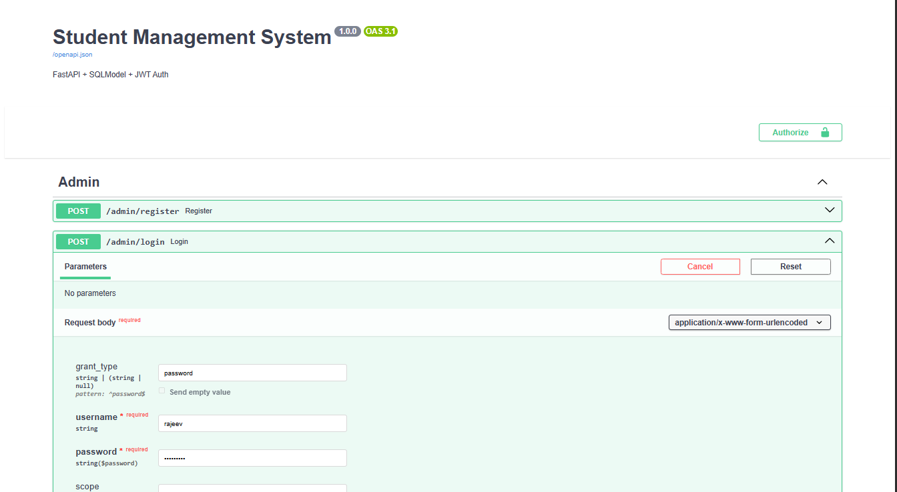
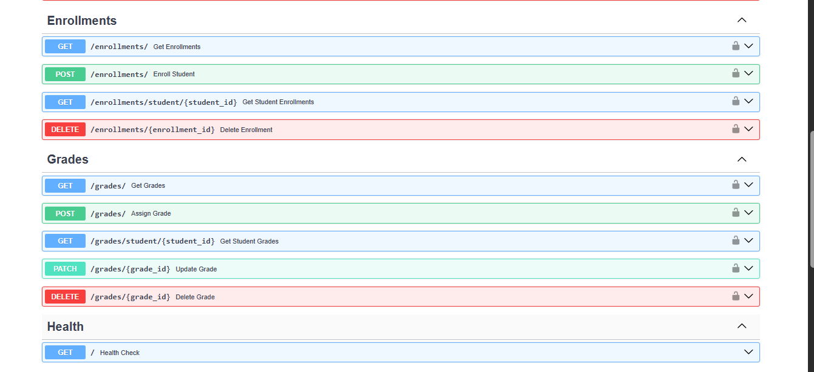

# Student Management System

A REST API built with FastAPI for managing students, courses, enrollments, and grades with JWT based authentication.

**Live Demo:** https://web-production-617bc.up.railway.app/docs

## Tech Stack

FastAPI · SQLModel · JWT (python-jose) · passlib (bcrypt) · SQLite · Uvicorn

## Features

- JWT-secured admin registration and login
- Full CRUD for Students, Courses, Enrollments, and Grades
- Duplicate checks for emails, course codes, and enrollments
- Marks validation (0-100)
- Auto-generated Swagger docs at `/docs`

## Screenshots

### API Routes


### Admin Authentication


### Grades and Enrollments


## Setup

```bash
git clone https://github.com/21f3001527/student-management.git
cd student-management
pip install -r requirements.txt
uvicorn main:app --reload
```

Visit `http://127.0.0.1:8000/docs` for the interactive Swagger UI.

## API Endpoints

| Module | Base Route | Operations |
|--------|-----------|------------|
| Admin | `/admin` | register, login |
| Students | `/students` | POST, GET (all/by id), PATCH, DELETE |
| Courses | `/courses` | POST, GET (all/by id), PATCH, DELETE |
| Enrollments | `/enrollments` | POST, GET (all/by student), DELETE |
| Grades | `/grades` | POST, GET (all/by student), PATCH, DELETE |

All routes except `/admin/register` and `/admin/login` require a valid JWT token.

## Authentication Flow

1. Register via `POST /admin/register`
2. Login via `POST /admin/login` to get an access token
3. Click **Authorize** in Swagger UI (`/docs`) and paste the token
4. All protected routes become accessible

## Why FastAPI

ASGI-based (async by default, faster than Flask's WSGI), auto-generated Swagger docs from type hints, built-in Pydantic validation, and automatic 422 error responses for invalid input.

## Contact

**Rajeev Kumar**
- LinkedIn: [rajeev245](https://www.linkedin.com/in/rajeev245/)
- GitHub: [21f3001527](https://github.com/21f3001527)
- Email: rajeev90767@gmail.com
